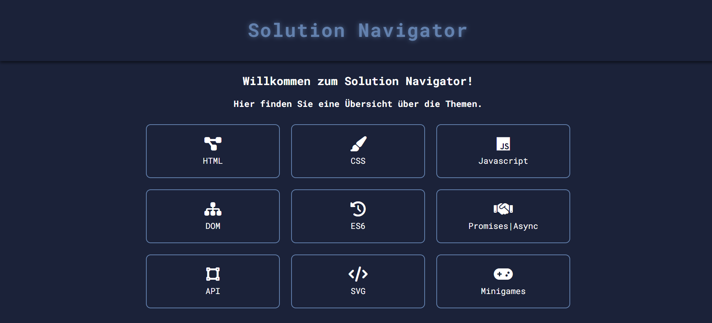

# 🌐 Web Engineering – Praxis-Website

Ein selbstgebautes Webprojekt im Rahmen der Veranstaltung **Web Engineering WS 2024/25**.  
Ziel war es, moderne Webentwicklung mit **HTML, CSS und JavaScript** ohne Frameworks zu verstehen und eigenständig eine Mini-Website zu erstellen.

## 🔧 Technologien

- HTML5 (Semantik, Struktur)
- CSS3 (Layout mit Flexbox/Grid, responsives Design, Farben, Buttons)
- Vanilla JavaScript (DOM-Manipulation, Events, kleine Funktionen)

## 🧱 Aufbau der Website

- **Startseite:** Übersicht über Inhalte + Navigation
- **Themenseiten / Module:** Wireframe| CSS | Javascript | DOM | ES6 | Promises | SVG | Minispiele
- **Interaktive Elemente:** z. B. Formular, Ladebalken, Hover-Karten
- **Responsives Layout:** Optimiert für Desktop und Mobile

## 🎯 Lernziele & Motivation

- Verständnis für den Aufbau einer statischen Website
- Trennung von Struktur (HTML), Design (CSS) und Verhalten (JS)
- Anwendung von semantischem HTML
- Einstieg in sauberen, modularen Code
- erste Nutzung von Git & GitHub zur Projektversionierung

## 📸 Vorschau

## 📎 Autor

**Huy Minh To**  
[GitHub-Profil](https://github.com/HuyMinhTo)

---

